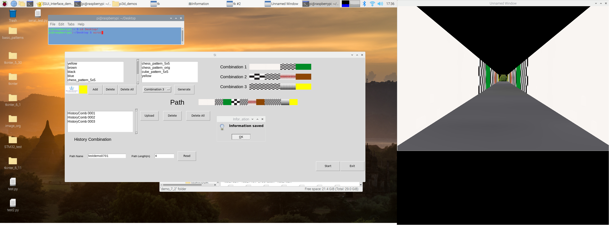

# mouseVR
Head-fixed Mice Virtual Reality System Update: 9/12/2021

This project supports naturalistic research about how mice cranial nerves respond when running under visual stimuli (especially gratings or dot stimuli). Implementing a Virtual Reality (VR) environment can create a more realistic environment for the experiment. The overall system will be used as a part of further research with several behavioral boxes. The main parts of this project are: 1) designing a VR environment that can synchronize the mice movement to the virtual corridor with low latency. 2) Create a graphical user interface (GUI) to adjust, generate and store information for the corridor. The prototype virtual corridor has some essential functions. You can download the most recent demo videos on [this Google Drive](https://drive.google.com/drive/u/2/folders/1Ucv_41gNv25MAfak_pyqquLuZ15v62hw) (you may ask for permission to access the videos).

## Hardware:
1. _Arduino Nano_: Tracking and converting mice movement on a treadmill to serial data. 
2. _Raspberry Pi 4_: Building and simulating the VR environment.
3. _TI DLPDLCR2010EVM_: Projector.
4) _ESP32_: Run as the rotary encoder and Bluetooth/WiFi for further development.

## Software: 
1. _Python 3.7.x_: Used for designing the corridor. _Python_ is the primary language used in this project. 
2. _Raspberry Pi OS (32-bit)_: OS for Raspberry Pi.
3. _Tkinter_: Designing the user interface.

## Instructions
How to setup and run the demo:
1. Download, unzip the python file `demo_7_2.zip` file under `MouseVR/demo_complete to pi3d/pi3d_demo`.
2. Run `python3 GUI_Interface_demo_7_2.py` to open GUI and run the VR environment.
3. `nuke.py`: this script cleans all history combination/path files and other data. Run: `python3 nuke.py`
4. `Corridor_demo_7_2.py`: Individual VR corridor. Run: `python3 Corridor_demo_7_2.py`

### Overall look screenshot:

### Overall look with projector:

## Additional Information
### What we have done:
1. We have built the primary part for the system, which can simultaneously run and show the VR environment on the computer display.
2. Finish the prototype GUI.
3. Test the whole system with several test benches.

### What we are currently working on:
1. Replace Arduino with ESP32 for further development.
2. Try communicating Android Studio App with gyroscope data captured with the VR environment, mimicking the rotating movement of mice head.
                
### Future plan:
1. Optimize the durability and accuracy of the system.
2. Adding an RFID sensor to increase the accuracy of synchronization.
3. Implement an algorithm that can stabilize the total brightness of the whole VR environment, either OpenCV or FPGA.

## Relative Document
1. _p13d Library_:
https://pi3d.github.io/html/ReadMe.html
2. _ESP Arduino IDE board manager setup_:
https://github.com/espressif/arduino-esp32
3. _Hardware setup_:
https://github.com/HarveyLab/mouseVR
4. _Triple display with Raspberry Pi 4_: https://www.raspberrypi.org/forums/viewtopic.php?t=243812#:~:text=The%20Raspberry%20Pi%204%20has,maybe%204K30%20will%20be%20supported

## Relative products:
1. _PhenoSys_: https://www.phenosys.com/products/virtual-reality
2. _Large Spherical Treadmill for Rodents_: https://www.janelia.org/open-science/large-spherical-treadmill-rodents
3. _DLP® LightCrafter™ Display 2010 Evaluation Module_: https://www.ti.com/store/ti/en/p/product/?p=DLPDLCR2010EVM

## Relative paper: 
1. The mouse in the video game ([doi:10.1038/d41586-019-00791-w](https://doi.org/10.1038/d41586-019-00791-w))
2. Virtual reality systems for rodents ([doi:10.1093/cz/zow070](https://doi.org/10.1093/cz/zow070))
3. Changing reward expectation transforms spatial encoding and retrieval in the hippocampus ([doi:10.1101/2020.09.13.295469](https://doi.org/10.1101/2020.09.13.295469))
4. Visual cue-related activity of cells in the medial entorhinal cortex during navigation in virtual reality ([doi:10.7554/eLife.43140](https://doi.org/10.7554/eLife.43140))
