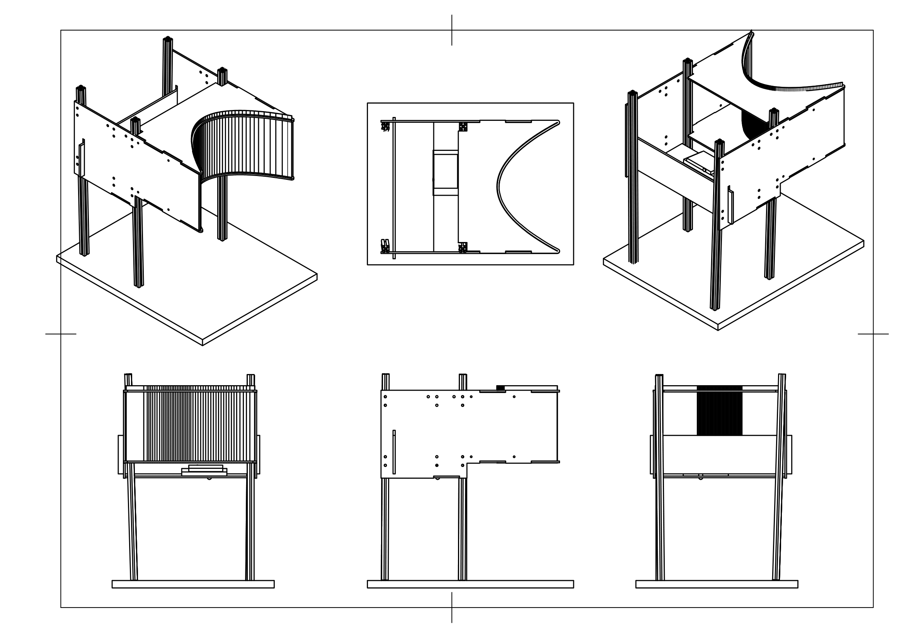

# Instructions and files for building the screen.

The design is based on the screen developed in [Chris Harvey's lab](https://github.com/HarveyLab/mouseVR). It is highly recommended to read that documentation along with ours to tailor the VR environment to the user’s needs. Since the laser projector in the original description is not available any more, we used a LED projector from Texas Instrument. The projection angle (keystone) is different from that of a laser projector we, we slightly modified the design by mounting the device underneath the screen and simplifying the mirror system. 

## Bill of materials

| material | description | source |
| -------- | ----------- | ------ |
| DLP® LightCrafter™ Display 2010 Evaluation Module [^1] | DLPDLCR2010EVM |Texas Instrument |
|front surface mirror|114 mm x 418 mm|[first surface mirror](https://firstsurfacemirror.com/)|
| acrylic mirror [^2] | cheap alternative| XXXX |
|plastic sheets| as per the design files| e.g., [Canal Plastic Center](https://www.canalplastic.com/)|
|24" x 48" Matte white diffusion paper|screen material|e.g., [this](https://www.bhphotovideo.com/c/product/44042-REG/Rosco_RS302611_3026_Filter_Tough.html)| 

[^1]: at the time of the writing, this module was unavailable at TI's website. We probably recommend DLPDLCR230NPEVM.
[^2]: Crispier image qulaity can be achieved by investing in a more expensive [front surface mirror](https://firstsurfacemirror.com/) 

### Assembling instructions:

### Final look:
