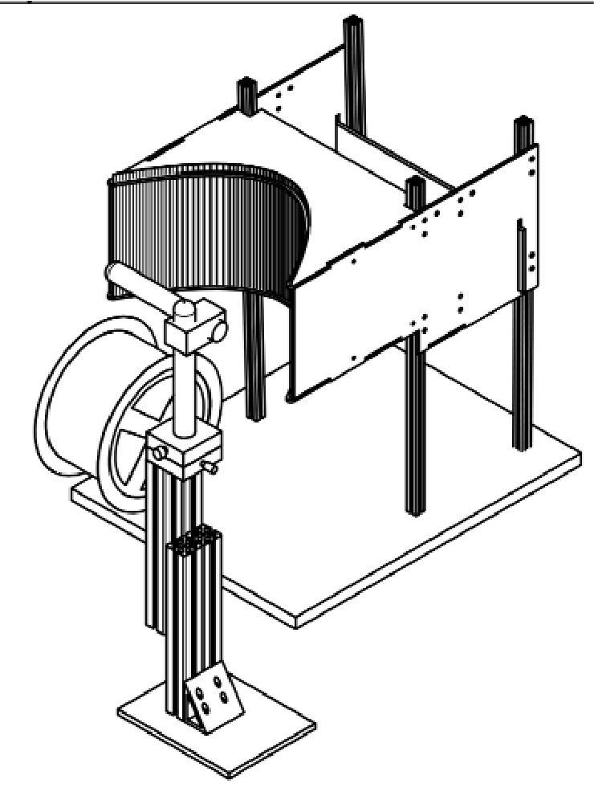

# Instructions and files for assembling the runinng wheel.

## Bill of Materials

| material | description | source |
| -------- | ----------- | ------ |
| acrylic sheet | XXX mm thick | e.g., Canalplastic|
| acrylic cylinder | XXX diam | ??? |
| ball bearing | XXX | McMasterr Carr |
| aluminum extrusion | xxx m | 8020.net |
| rotary encoder | cat# | Digikey |
| ESP32 | cat# | Digikey |
| axle | cat# | McMasterr Carr |
| optical breadboard | cat# | Throlabs|

#### Final Assembly
