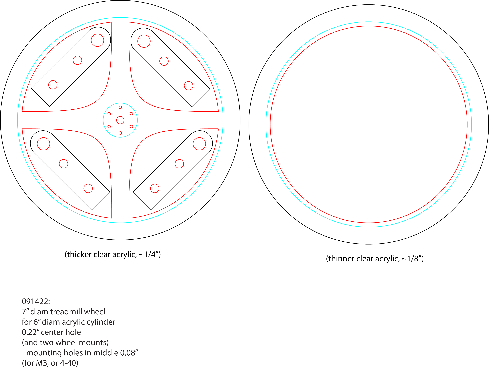
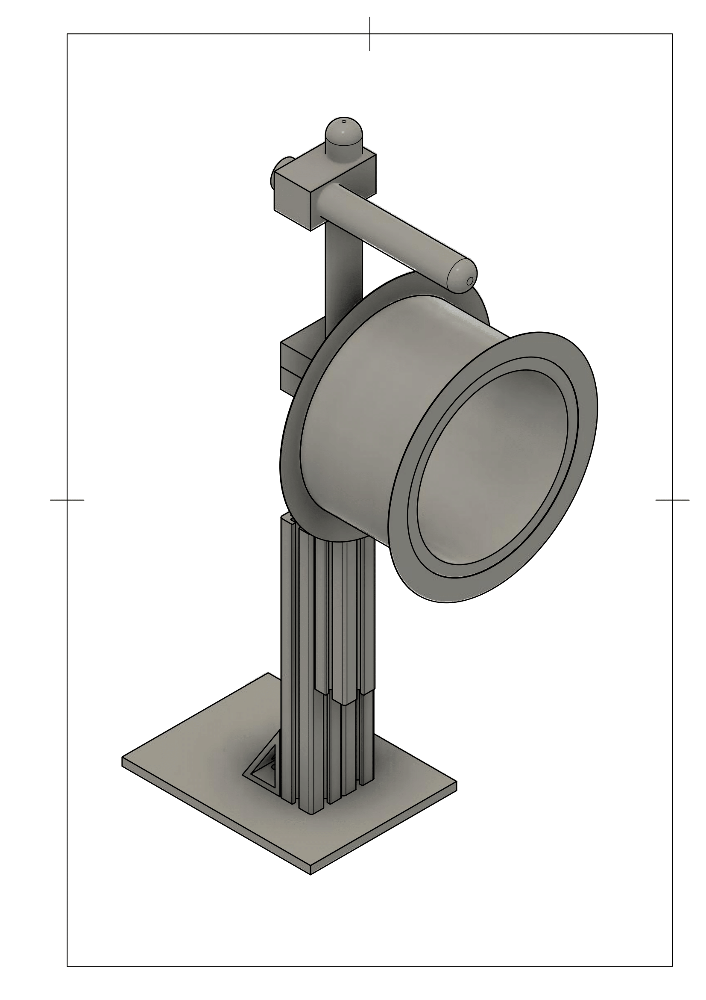

# Instructions and files for assembling the runinng wheel.

We use XXX" thick, clear acrylic to cut out the wheel parts found in `runningWheel_6inCyl_sideMount_JoVE_091422a.ai`.

## Bill of Materials

| material | description | source |
| -------- | ----------- | ------ |
| acrylic sheet, laser cutting template[^1]  | XXX mm thick | e.g., Canalplastic|
| acrylic cylinder | 6" diam, 3" thick | ??? |
|acrylic cement|gluing the parts|e.g., [this](https://www.amazon.com/SCIGRIP-10315-Acrylic-Cement-Low-VOC/dp/B003HNFLMY)|
| ball bearing | XXX | McMasterr Carr |
| T-slotted aluminum extrusion [^2] | 2 x 7" | 8020.net |
| axle | 1/4" diam, XXX" long | McMasterr Carr |
| optical breadboard | base, as per user's requirements | Throlabs|
|shaft coupler|coupling the axis to the rotary encoder| [McMaster-Carr](https://www.mcmaster.com/shaft-couplings/set-screw-precision-flexible-shaft-couplings/for-shaft-misalignment-type~axial/system-of-measurement~inch/for-shaft-diameter~1-4/length~3-4-2/)|
|shaft sleeve thingy|keeping the axis in the center of the wheel|????|

#### Wheel laser cutting template:
[^1]: The same template is atteched here with .ai, .dxf and .svg extensions. 
[^2]: We used 1020 (dual) style extrusion profiles for this build for increased stability. Fasteners and brackets can also be sourced from 8020.net 

#### Final Assembly

